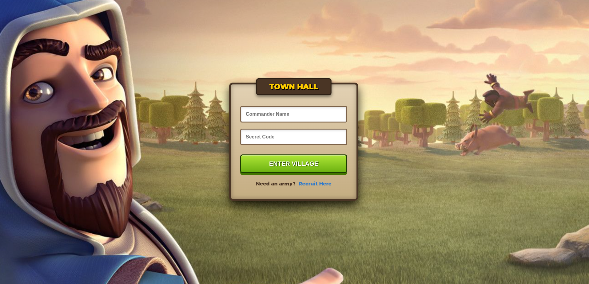
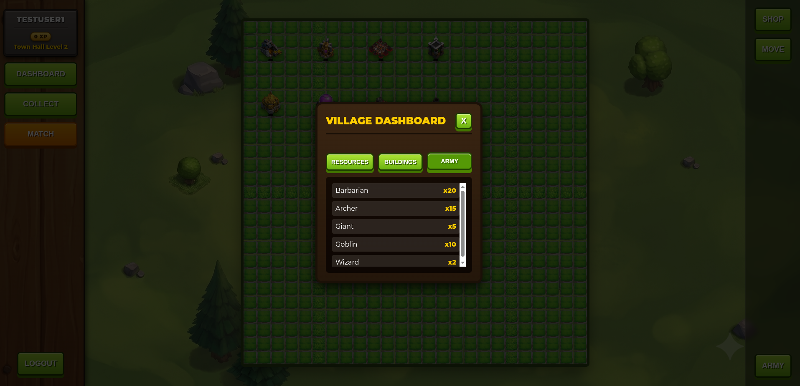
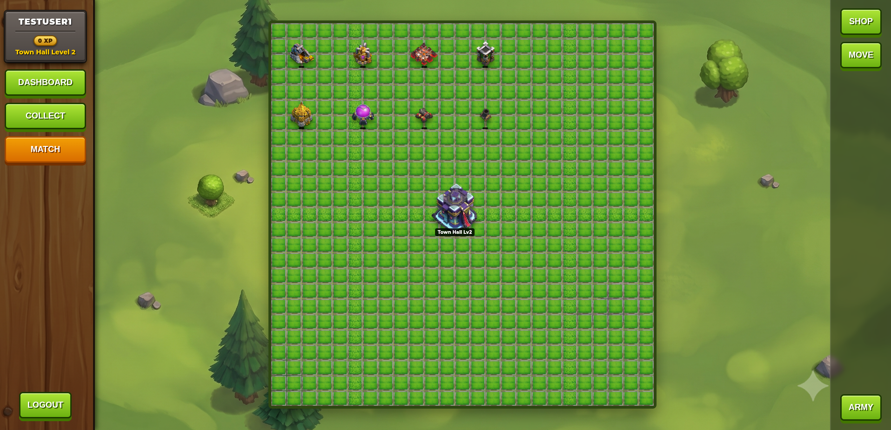
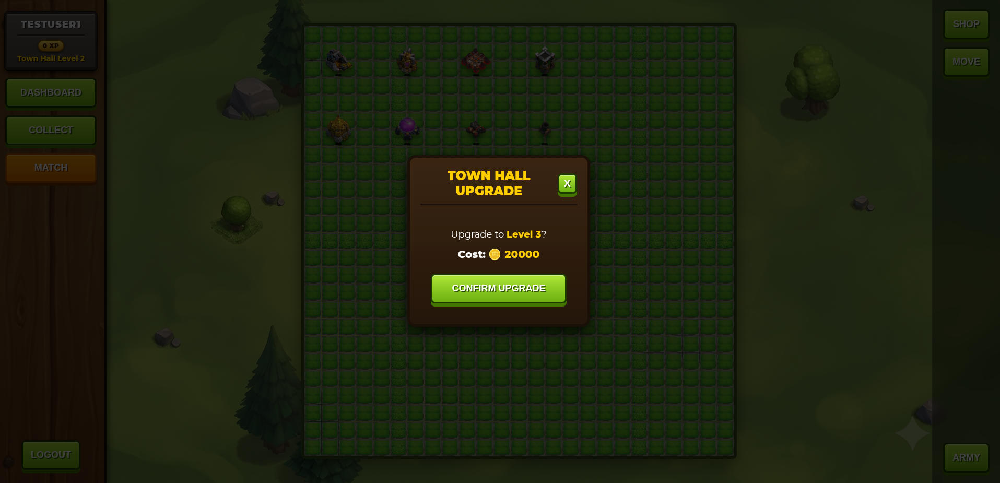
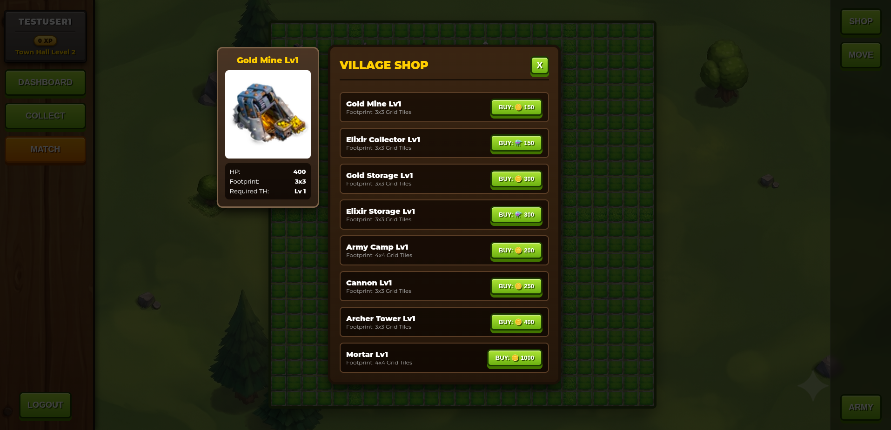
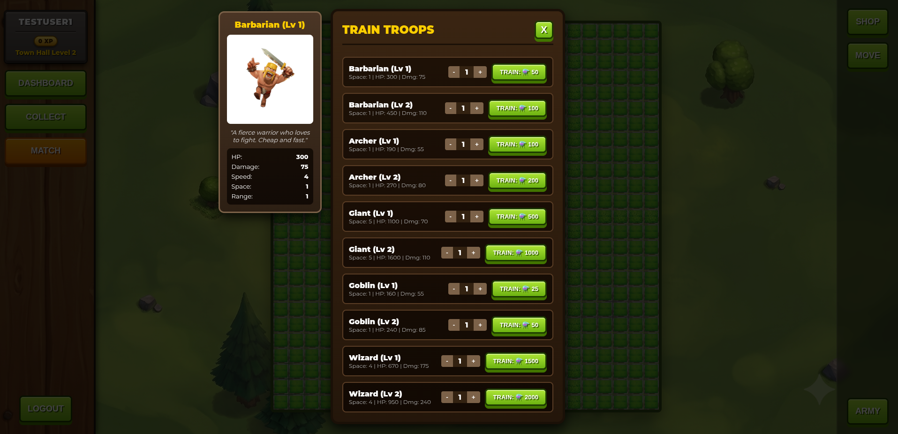

# mvc_assignment

A high-performance (COC inspired) full-stack game server built in Go, utilizing Postgres for storage, Docker for containerization, and secure JWT authentication.

Local setup 

Please ensure you have docker and go installed.

### 1. Clone the repository & Navigate inside
```
git clone https://github.com/gaurangivishwakarma-ui/mvc_assignment
cd mvc_assignment
```

### 2.Create a .env file in the root directory and paste these settings:
```
DB_USER=root
DB_PASSWORD=secret
DB_HOST=localhost
DB_PORT=5432
DB_NAME=game_db
DB_SSLMODE=disable
SERVER_PORT=8080
JWT_SECRET=yoursupersecuresecretkeychangeitlater
```
### 3. Run docker compose

```
docker compose up --build -d
```
to stop everything:
```
docker compose down -v
```


### Available API Routes

**Authentication**
- `POST /api/register` - Register a new player
- `POST /api/login` - Authenticate and receive a JWT token

  <details>
  <summary>View Login Screen</summary>
  
  </details>

**Player & Dashboard** (Requires Auth)
- `GET /api/player/dashboard` - Get player details and summary

  <details>
  <summary>View Dashboard</summary>
  
  </details>

**Village Management** (Requires Auth)
- `GET /api/village` - Retrieve the layout of the player's village

  <details>
  <summary>View Village Layout</summary>
  
  </details>
- `POST /api/village/buildings` - Purchase and place a new building
- `POST /api/village/buildings/upgrade` - Initiate a building upgrade

  <details>
  <summary>View Upgrade Modal</summary>
  
  </details>
- `GET /api/village/buildings/upgrade/cost` - Get the cost of upgrading a specific building
- `POST /api/village/buildings/complete` - Complete a building upgrade
- `POST /api/village/move-building` - Move a building to new coordinates
- `POST /api/village/upgrade` - Upgrade the village level
- `GET /api/village/upgrade/cost` - Get the resource cost for upgrading the village
- `POST /api/village/collect` - Collect produced resources

**Shop & Army** (Requires Auth)
- `GET /api/shop/catalog` - View the catalog of available buildings

  <details>
  <summary>View Shop</summary>
  
  </details>
- `GET /api/army/catalog` - View the catalog of available troops
- `POST /api/army/train` - Train troops

  <details>
  <summary>View Train Troops</summary>
  
  </details>
- `GET /api/army/status` - View currently owned troops

**Battle System** (Requires Auth)
- `GET /api/battle/match` - Find an opponent for battle
- `POST /api/battle/attack` - Launch an attack against an opponent
- `GET /api/battle/replay` - View past battle logs and replays

### Features of Game
- **Real-time Village Building:** Construct and upgrade a variety of buildings to expand your village.
- **Resource Management:** Collect, store, and manage resources like Gold and Elixir.
- **Strategic Combat:** Train different troops and engage in battles against other villages.
- **Progressive Upgrades:** Enhance your buildings and troops as your village levels up.
- **Interactive UI:** Seamless dashboard for village management and tactical combat grid for battles.
- **Full-Stack Architecture:** Powered by a robust Go backend utilizing MVC pattern and a modern frontend interface.

### Basic Game Rules
- Players start with a basic village and must accumulate Gold and Elixir.
- Buildings require a specific amount of resources to be constructed or upgraded.
- Certain buildings and upgrades require the player's village to reach a certain level.
- Players can train troops in the Army Camp using Elixir.
- Battles involve deploying trained troops against the opponent's defensive buildings and layout. If troops deplete the enemy's defenses and buildings, the player wins the battle.
- Defense buildings protect the village by attacking incoming enemy troops.

### Buildings & Troops Available

**Available Buildings:**

| Category | Buildings | Description |
| :--- | :--- | :--- |
| **Resource** | Gold Mine, Elixir Collector | Generates resources (Gold/Elixir) over time. |
| **Storage** | Gold Storage, Elixir Storage | Increases maximum resource capacity. |
| **Army** | Army Camp | Houses trained troops. |
| **Defense (Cannon)** | Cannon | Slow, hits hard, short range. |
| **Defense (Archer Tower)** | Archer Tower | Fast, moderate damage, longer range. |
| **Defense (Mortar)** | Mortar | Area damage, very slow, long range. |

**Available Troops:**

| Troop | Characteristics | Description |
| :--- | :--- | :--- |
| **Barbarian** | Melee, Cheap, Fast | A fierce warrior who loves to fight. |
| **Archer** | Ranged, Low HP | A sharp-eyed bowwoman who can attack from a distance. |
| **Giant** | Tank, High HP | A slow but mighty giant who charges straight at defenses. |
| **Goblin** | Fast, Anti-Resource | A sneaky goblin obsessed with stealing gold and elixir. Deals double damage to resource buildings. |
| **Wizard** | Area Damage, High Cost | A powerful spellcaster who deals area damage. |

### Tech Stack Used

- **Backend:** Go (Golang), net/http standard library
- **Architecture:** Model-View-Controller (MVC) Pattern
- **Database:** PostgreSQL with `pgxpool` and `sqlc` for type-safe queries
- **Frontend:** React.js, Vite
- **Authentication:** JWT (JSON Web Tokens)
- **Containerization:** Docker & Docker Compose
